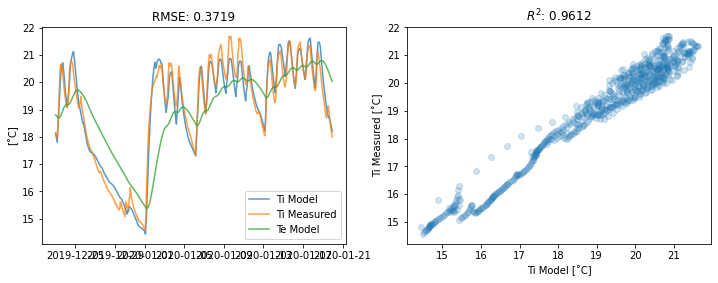
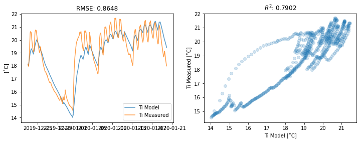
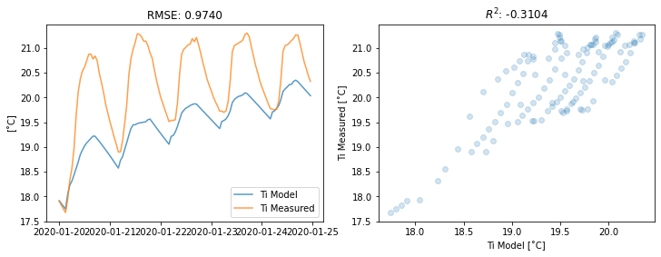

# Data-Driven Thermal Models for Buildings
## DarkGreyBox: An Open-Source Python Building Thermal Model Inspired By Genetic Algorithms and Machine Learning

### Why is this important?
Constructing simple, accurate and easy-to-interpret thermal models for existing buildings is essential in reducing the environmental impact of our built environment. Think about a large office building that is currently heated by natural gas boilers - how would you evaluate the potential reduction in CO_2e emissions in case the boilers were replaced by a heat pump system which have greatly varying efficiencies at different flow temperatures?

Another interesting area to investigate is demand-side response (DSR). Imagine that the proposed heat pump system is connected to the National Grid Carbon Intensity Forecast API, which provides 24-hours forecasts of electricity carbon intensity at a 30-minute temporal resolution. Would it be possible to use the building as a "thermal battery" i.e. slightly increase the temperature of the building during the periods with low carbon intensities and let the building "discharge" during the carbon intesity peaks without significanlty affecting the thermal comfort of its occupants? 

The thermal response model of the building is a key component in both the above examples, however, buildings are complicated systems and modelling their thermal behaviour is certainly not straightforward.

### What options have we got?
White-box modelling is where the thermal behaviour of the building and its associated heating system is assumed to be known and deterministic. Its advantage is that its results are easy to  interpret, however, the construction of the model requires a really detailed knowledge of the building construction (exact thermal properties of each structural material, thermal bridges, air change rate etc.). Also, there is no straightforward way to adjust the model based on measured data resulting in relatively high errors when modelling existing building performance. Therefore, these models are usually used at the planning stage, where the necessary details are available but no measured data are available yet. 

Black-box modelling is where based on measured data, the input variables (e.g. weather, internal temperature setpoints) are mapped to the output variables (e.g. actual internal temperature, energy consumption of the heating system). Usually, a machine learning (ML) algorithm is employed to carry out this mapping which yields low modelling errors at the expense of the complex mapping being very difficult / impossible to interpret by humans making it unsuitable for optimisation frameworks to encapsulate such models.

Grey-box modelling is the middle ground between white-box and black-box modelling combining the easy model interpretability of the former with low modelling errors of the latter. A grey-box model mathematically describes the modelled building as a simplified thermal system. The mathematical model consists of a system of continuous-time stochastic differential equations and discrete-time measurement equations. The thermal model is parameterised by thermal resistances, heat capacities and energy inputs analogous to an electrical RC-circuit. The model parameters are fit to the measured data...

### How does a grey-box thermal model work?
Grey-box models are not easy to construct though. 
* Successfully finding the global optima of the model parameters is heavily influenced by their initial condition values. These have to be estimated based on calculations not dissimilar to white-box modelling.
* Usually, a specific excitation signal needs to be injected into the building to aid model convergence and performance evaluation
* The rate of model convergence is inverse proportional to the number of model parameters (i.e. model complexity) and the amount of data available.

However, in a real-life situation usually:
* We have no detailed knowledge of the building's thermal properties (i.e. our initial conditions are likely to be far from ideal)
* We only have access to measured data but no possiblity of injecting a thermal excitation signal
* We want a fairly complex model fit to a long period of measure data

This results in the fitting process frequently (almost always) falling over 

The unknown parameters of the thermal models are usually estimated by using maximum likelihood estimation and compared using statistical methods (likelihood ratio tests, autocorrelation functions and cumulated periodograms). However, this approach has been mostly applied for either simplified thermal structures (e.g. experimental test cells) or in case a specific excitation signal was injected into the building. The complexity of a four-storey office building with a total of 1600m2 floor space coupled with a heating system equipped with sensors that provide data at a much reduced quality when compared to experimental test setups make the above approach highly unstable. 

### Are there any open-source packages that can do this?

### Reality check?
R package: CSTM As a data scientist I write 95% of my code in Python and The disadvantage of this is that 

Uses (what) to evaluate model complexity vs. computational intesity
Since the release of CSTM computational performance has become cheap and widely available. What I want is to get the best performing model without worrying about its complexity.

What if we could take the structure that the existing grey-box model provides (i.e. the RC thermal equivalent) spice it up with a pinch of genetic algorithms and drop it into a machine learning-inspired framework?

CSTM-R
reality check
Feature-engineering vs Network-engineering

### ML and GA 

### Demo Time!!!

Machine learning frameworks provide a wide range of functionality and `DarkGreyBox` allows us to tap into these features easily.

As usual in ML, first we want to split our dataset into training and test data (the fitting process will only ever see the training data and we can use the test data to evaluate how well the models generalise/perform on new data). The code below takes the input data spanning 33 days and splits them so that the test set will span 5 days.  

```python
from sklearn.model_selection import train_test_split
X_train, X_test, y_train, y_test = train_test_split(input_X, input_y, test_size=5/33, shuffle=False)
```

Next, we need to define the initial conditions of the model parameters. The initial condition of the internal temperature `Ti` is the first element of our Ti measured data and hence we do not allow it to vary. We do not need to have any preliminary knowledge of the other parameters' initial conditions and so they can be set to a default value.

```python
train_params_Ti = {
    'Ti0': {'value': X_train.iloc[0]['Ti0'], 'vary': False},
    'Ci': {'value': 1},
    'Ria': {'value': 1},
}
```

We can instantiate a range of models to be evaluated - in this case we are setting up 5 different models starting from the simplest `Ti` to `TiTeThRia` with medium complexity.

```python
models = [Ti(train_params_Ti, rec_duration),
          TiTe(train_params_TiTe, rec_duration),
          TiTh(train_params_TiTh, rec_duration),
          TiTeTh(train_params_TiTeTh, rec_duration),
          TiTeThRia(train_params_TiTeThRia, rec_duration)]
```

As we have no idea about the initial conditions of the models' parameters (we used default values) our fitting process is likely to fall over except for maybe the simplest (Ti) model. We can try to reduce the complexity of the problem - so that our fitter has an easier job to do - by either reducing model complexity by having a smaller number of parameters (we do not want to do that) or by fitting to less data. If our fitting process will converge when we feed it less data, we can "excite" those initial conditions to move from the default values towards the global optima when fitting for the entire training set. Practically, we can do this by splitting the training data set into much shorter prefit data sets and prefit to those. `Sklearn` is quite helpful here again, in case we wanted to define the prefit sets to be 1 day (24 hours) long:

```python
from sklearn.model_selection KFold
prefit_splits = KFold(n_splits=int(len(X_train) / 24), shuffle=False).split(X_train)
```

To evaluate the performance of our models we will need to define an error metric. Again, there is a wide range of options available from `sklearn`:

```python
from sklearn.metrics import mean_squared_error
error_metric = mean_squared_error
```

We can define a prefit "survival threshold" to trim the number of model fits during the training process. Any models achieving a higher error during the prefit stage will not make it into the training stage.

```python
prefit_filter = lambda error: abs(error) < 2
```


Under the hood, `DarkGreyBox` uses `lmfit.minimize` to fit the thermal model parameters to the training data by passing it a custom objective function defined by the model class. The method used by `lmfit.minimize` can be customised as well, and while the standard Nelder-Mead and Levenberg-Marquardt methods work well in general, it is worth experimenting with others (see here for a list of supported methods: https://lmfit.github.io/lmfit-py/fitting.html#fit-methods-table).

```python
method = 'nelder'
```

Setting up is ready! We only need to call the `darkgreyfit` convenience pipeline function that delegates the work to the prefit, train and test low-level procedures running on multiple processes and reducing / cleaning the interim results. The returned `pandas.DataFrame` contains the fit models and their train/test performance evaluation.   

```python
from darkgreybox.fit import darkgreyfit
df = darkgreyfit(models, X_train, y_train, X_test, y_test, ic_params_map, error_metric,
                 prefit_splits=prefit_splits, prefit_filter=None, reduce_train_results=True, 
                 method=method, n_jobs=-1, verbose=10)
```

In this specific example:
* 140 models were prefit to 24 hour data chunks
* 110 models survived the prefit filter and made it into training on the entire training set 
* Out of the 110 models trained, 11 distinct models were found (i.e. many pipes were arriving at the same parameter set results)

So here are the results of the most (`TiTeThRia`) and least (`Ti`) complex models.




The results show that the `TiTeThRia` model has a good fit on the training set (R2=0.9612) and the errors are low for both the training and test sets indicating that the model generalises well for data it hasn't seen before (no overfitting problem).

[Problem data]




The `Ti` model has a poor fit on the training set (R2=0.79) which is clear from the temperature plots as well. Due to low model complexity there is a definite underfitting problem going in here, which of course also results in poor test set performance.

### Quick Validation


